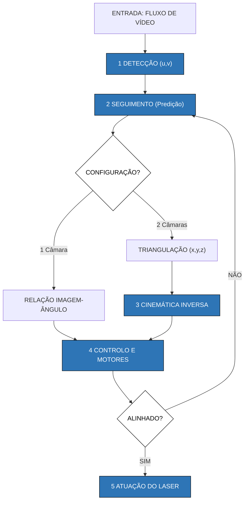

Frase tese: "The reasonable man adapts himself to the world; the unreasonable one persists in trying to adapt the world to himself. Therefor, all progress depends on the unreasonable man." George Bernard Show, Man and Superman
## 1. Introdução
A proliferação de Sistemas Aéreos Não Tripulados (UAS) redefiniu os paradigmas do conflito moderno, conferindo vantagens táticas sem precedentes a forças atacantes através de plataformas de baixo custo e elevada eficácia \cite{rogers2023second}. Neste contexto, os sistemas laser, apresentam-se como uma solução disruptiva, oferecendo uma capacidade de resposta à velocidade da luz, precisão milimétrica e um custo operacional marginal.
$\quad$ [parte omitida][A Secção 1.1 aborda o contexto geral e motivação que a presente dissertação assenta. O problema particular investigado na presente dissertação é definido na Secção 1.2. Na Secção 1.3 estão descritos os objetivos que se pretende alcançar. E por fim, na Secção 1.4 descreve-se a estrutura da presente dissertação.]

### 1.1 Contexto Geral e Motivação
[The silent force multiplier: The history and role of UAVs in warfare](https://ieeexplore.ieee.org/abstract/document/4161584/?casa_token=okQT0uqR-wUAAAAA:nz7WUZtCArBO2q412smFIZbuYO7zVcmLFctWPmFN3TX94QERumnfu-FLvSyoc-CEeqiol0fSgKE)

A proliferação de Sistemas Aéreos Não Tripulados (UAS) alterou a dinâmica do campo de batalha, proporcionando uma superioridade operacional decisiva em cenários de guerra moderna [astrailian departmant](https://cybershafarat.com/wp-content/uploads/2024/12/Drones_in_Modern_Warfare_Lessons_Learnt_from_the_War_in_Ukraine.pdf). Em teatros de operações contemporâneos, a utilização intensiva de táticas de enxame (\emph{swarms}) visa especificamente a saturação da capacidade de resposta dos sistemas defensivos convencionais. Esta estratégia é materializada no atual conflito entre a Rússia e a Ucrânia, onde se registou a projeção de mais de 50000 drones pelas forças russas apenas em 2025. [November 2025 Updated Analysis of Russian Shahed-type UAVs Deployment Against Ukraine](https://isis-online.org/uploads/isis-reports/documents/November-2025-Updated-Analysis-of-Russian-Shahed-type-UAVs-Deployment-Against-Ukraine_Final.pdf) Tal volume operacional torna-se economicamente sustentável devido ao custo unitário de fabrico destes instrumentos, estimado em cerca de 50kUSD. [Drone Saturation Russia’s Shahed Campaign](https://csis-website-prod.s3.amazonaws.com/s3fs-public/2025-05/250513_Jensen_Drone_Saturations.pdf?VersionId=QsQBXrKcuEpHw4yK0EoTr7ZIraS5yTMW) 
$\quad$Neste cenário, a interceção baseada em projéteis balísticos revela limitações críticas. A reduzida secção eficaz de radar (RCS) e as dimensões físicas dos alvos, aliadas à sua elevada capacidade de manobra, dificultam as soluções de tiro preditivas.[Drone RCS Statistical Behaviour](https://publications.sto.nato.int/publications/STO%20Meeting%20Proceedings/STO-MP-MSG-SET-183/MP-MSG-SET-183-04.pdf)  Ao contrário de um sistema guiado, uma munição balística segue uma trajetória determinística após o disparo, impossibilitando a compensação de alterações no vetor de estado do alvo durante o tempo de voo. Assim sendo, projéteis balísticos apresentam uma menor probabilidade de neutralização contra drones e a solução convencional recai sobre a utilização de mísseis com sistemas de guiamento ativo, com capacidade para corrigir a trajetória por forma a intercetar a ameaça. Esta abordagem impõe um desafio a nível logístico dado que o número de mísseis disponíveis normalmente situa-se na ordem das dezenas, tornando-a vulnerável à saturação por enxames. Adicionalmente, verifica-se uma assimetria de custos, o custo unitário de um míssil é de ordens de grandeza superior ao de um drone comercial adaptado, sendo desfavorável economicamente para o defensor.  
$\quad$ Uma possível resposta tecnológica para superar estas limitações reside na adoção de sistemas laser. A vantagem fundamental desta abordagem é que, devido à propagação do feixe ser à velocidade da luz, o tempo de voo é praticamente nulo. A disparidade temporal torna-se evidente num cenário de interceção a $d = 1000\,m$, dado que o laser é quase instantâneo e um projétil cinético convencional ($v_{proj} \approx 870 \, m/s$) introduz um atraso superior a $1\,s$ até atingir o alvo. Esse atraso do projétil exige a previsão da posição futura do alvo com uma antecedência considerável, o que permite que uma manobra evasiva invalide a solução de tiro calculada no instante $t_0$. Em contraste, a interação do laser é quase instantânea, pelo que o sistema deixa de necessitar de algoritmos de predições balísticas de longo prazo, exigindo apenas algoritmos de rastreio (_tracking_) capazes de compensar a dinâmica do alvo em tempo real.
$\quad$ Adicionalmente, este sistema apresenta a vantagem logística de utilizar a energia elétrica gerada pela própria plataforma. Ao eliminar a dependência de um número finito de projéteis armazenados, o laser oferece uma capacidade de disparo virtualmente ilimitada e um custo operacional significativamente reduzido. Simultaneamente, a precisão ótica do feixe permite concentrar a energia num ponto específico, garantindo a neutralização do alvo sem causar os danos colaterais típicos das cargas explosivas ou cinéticas. A conjugação da resposta instantânea com a eficiência logística posiciona, assim, os sistemas laser como uma solução vital para os desafios da guerra assimétrica moderna.

#### 1.2 Definição do Problema

Atualmente, a Marinha Portuguesa não dispõe de sistemas de energia direcionada, o que resulta numa lacuna de capacidade face a ameaças assimétricas, nomeadamente enxames de drones e embarcações de alta velocidade, resultando num rácio de custo-benefício desfavorável caso sejam utilizados meios de defesa cinéticos tradicionais. A inexistência de uma plataforma experimental impede a vali dação técnica e operacional destas soluções em ambiente marítimo. Neste contexto,justifica-se o desenvolvimento de um protótipo funcional de um sistema laser capaz de mitigar as referidas vulnerabilidades. Desta forma, o desafio central reside no projeto de um sistema gimbal de dois eixos que, recorrendo a sensores óticos (RGB), execute a deteção, seguimento e neutralização de alvos aéreos de pequena dimensão. Este sistema deve garantir o seguimento, minimizando o erro do mesmo através de algoritmos de visão computacional, de modo a assegurar a máxima incidência do laser no alvo

Por serem sensores passivos, as câmaras RGB dependem exclusivamente da radiação refletida pelo alvo, o que impõe restrições operacionais significativas. A eficácia do sistema é, portanto, limitada pelo sensor em cenários de baixa luminosidade, pela saturação em condições de incidência solar direta e pelo espalhamento de luz em ambientes com elevada nebulosidade ou nevoeiro. Adicionalmente, a resolução espacial para distâncias até 1 km constitui um desafio crítico. Devido à geometria de projeção ótica, a área ocupada pelo alvo no sensor decresce quadraticamente com a distância (A ∝ 1/d2), resultando na diluição da assinatura do alvo no ruído de fundo e dificultando a sua correta deteção. Este cenário compromete também a estimativa de profundidade via estereoscopia utilizando câmeras, a distância ao alvo é normalmente muito superior à linha de base (distância entre câmeras), resultando em cálculos de coordenadas 3D inerentemente imprecisos. A nível da deteção, a seleção da arquitetura de visão computacional será pautada pelo compromisso entre a exatidão da posição e a latência de processamento dado que numa aplicação de seguimento em tempo real, o tempo de deteção constitui uma variável crítica para que o sistema consiga ser em tempo real.

A latência total do sistema ($τ_{total}$) é cumulativo e intrínseco à cadeia de processamento:
$$\tau_{total} = t_{captura} + t_{processamento} + t_{atuacao},$$
onde $t_{captura}$ é o tempo de aquisição do sensor, $t_{processamento}$ o tempo de execução dos algoritmos de visão computacional e cinemática inversa, e $t_{atuacao}$ o atraso mecânico dos motores. Desta forma, valor elevado de τtotal resulta num seguimento para uma posição obsoleta do alvo ($P_{t−τ}$), impossibilitando a neutralização de ameaças dinâmicas

$\quad$Relativamente à dinâmica, o sistema eletromecânico requer um dimensionamento de motores tal que a velocidade angular de saturação dos atuadores ($\omega_{sys}$) exceda a velocidade angular máxima da linha de vista do alvo ($\omega_{LOS}$):
$$\omega_{sys} \ge \omega_{LOS_{max}}.$$

Por fim, será necessário definir métricas de validação dos resultados experimentais, por forma a que seja possível quantificar a performance do sistema.
#### 1.3 Objetivo da dissertação

No presente trabalho pretende-se perceber qual a melhor forma de conceber um sistema de baixo custo e alta exatidão, baseado em câmaras, para a deteção, seguimento e neutralização de drones com uma arma laser. Para tal será necessário obter as abordagens de visão computacional que apresentam melhores resultados para sistemas em tempo real, perceber qual o tipo de motores que cumprirão com os requisitos mínimos propostos para o sistema, qual a potência e comprimento de onda necessários para neutralizar um drones nos limites máximos de seguimento e quais as métricas de avaliação mais adequadas a utilizar para a avaliação do sistema como um todo.   
$\quad$O objetivo desta dissertação consiste no desenvolvimento e validação experimental de uma prova de conceito de um sistema de deteção e seguimento de baixo custo, baseado em visão computacional. O projeto visa dotar a Marinha Portuguesa de conhecimento fundamental sobre a arquitetura, desafios de controlo e requisitos operacionais para uma possível futura implementação de sistemas laser no combate a ameaças assimétricas, especificamente drones.
No domínio da visão computacional, será utilizado processamento de imagem baseada em Redes Neuronais, treinadas especificamente para a deteção e classificação robusta de drones. Simultaneamente, será implementado um sistema de visão estereoscópica (duas câmaras) para a extração das coordenadas tridimensionais ($x, y, z$) do alvo, permitindo não só a estimativa de profundidade necessária para uma possível correção do foco do laser, mas também a predição de trajetória do alvo. Por fim, o estudo tem o objetivo de efetuar o dimensionamento teórico dos parâmetros físicos do emissor laser considerando as restrições impostas pela atenuação atmosférica e os requisitos térmicos para a neutralização eficaz da ameaça.
#### 1.4 Estrutura
==passar para o doc oficial==
Após o presente capítulo introdutório, a dissertação organiza-se em quatro secções subsequentes, estruturadas para fornecer o enquadramento teórico, a análise do estado da arte, a metodologia e o planeamento detalhado do desenvolvimento do protótipo.

O segundo capítulo dedica-se à Fundamentação Teórica, estabelecendo os princípios físicos e matemáticos transversais ao sistema. Nesta secção, serão abordados a cinemática e dinâmica de mecanismos \emph{gimbal}, a teoria de controlo em malha fechada e a geometria projetiva fundamental dos sensores óticos. Adicionalmente, o capítulo integra os fundamentos de Redes Neuronais Convolucionais (CNN) e arquitetura de transformers para a deteção e seguimento de objetos e a física de lasers necessária para suportar o dimensionamento teórico do sistema optoeletrónico.

$\quad$O terceiro capítulo apresenta o estado da arte, efetuando uma análise comparativa das soluções tecnológicas atuais no domínio de sistemas de armas laser, abrangendo desde iniciativas \emph{open-source} até sistemas de defesa proprietários. Este capítulo examinará as arquiteturas de controlo e os algoritmos de deteção e seguimento visual mais robustos documentados na literatura, definindo assim a linha base tecnológica para o desenvolvimento proposto.

A abordagem a ser utilizada é detalhada no quarto capítulo, referente à metodologia científica. O trabalho será apresentado através de uma decomposição em fases de desenvolvimento modular e incremental, justificando as opções de desenho, as ferramentas selecionadas e os critérios de validação experimental adotados para cada etapa, assim como possíveis alternativas no caso de resultados não satisfatórios.

A apresentação dos resultados preliminares será apresentado no quinto capítulo descrevendo o trabalho até ao momento realizado apresentando pontos a serem pontos a serem alterados e as ferramentas utilizadas para o desenvolvimento do trabalho preliminar.    

Por fim, o sexto capítulo expõe o Plano de Trabalhos, detalhando o cronograma de execução e a alocação temporal prevista para cada tarefa, de modo a evidenciar o caminho crítico do projeto e assegurar a exequibilidade dos objetivos dentro dos prazos académicos estipulados.

## Enquadramento Teórico

O desenvolvimento de um sistema laser autónomo exige uma abordagem multidisciplinar, integrando domínios que variam desde a mecânica até à utilização de redes neuronais. Para assegurar a viabilidade técnica do protótipo e a interpretação correta dos resultados experimentais, este capítulo estabelece o referencial teórico e a base matemática que sustentaram as decisões do protótipo.

Refazer==A secção 2.1 abordará os diversos sensores a utilizar e o seu funcionamento base. Na secção 2.2 será introduzido os conceitos da cinemática presente num sistema gimbal de dois eixos (Pitch-Yaw). A secção 2.3 apresentará os tipos de controlo utilizados e as suas diferenças. A secção 2.4 introduzirá o conceito da geometria de visão e a sua calibração. Por fim, irá ser abordados algoritmos base para a deteção e seguimento de objetos nas secções 2.5 e 2.6, respetivamente.==

### 2.1 Sensores e Atuadores
#### 2.1.1 Servo Motor
#### 2.1.2 Modelo de Câmara Pinhole

A capacidade de mapear objetos no espaço tridimensional através de uma câmara bidimensional depende estritamente do conhecimento dos parâmetros extrínsecos, que definem a pose — posição e orientação — da câmara em relação ao referencial global. Para sistematizar esta relação, é necessário distinguir três referenciais fundamentais: o referencial do mundo ($P_w$), onde o alvo é localizado espacialmente; o referencial da câmara ($P_c$), centrado no seu centro ótico; e o referencial da imagem ($p$), onde a informação é projetada em pixéis. Frequentemente, as coordenadas no mundo e na câmara são representadas por vetores $[X, Y, Z]^T$.

A transição de um ponto do referencial do mundo para o referencial da câmara é efetuada através de uma transformação de corpo rígido, expressa por uma matriz de transformação homogénea, $M_{ext}$. Esta matriz combina uma submatriz de rotação ($R$) e um vetor de translação ($t$):

$$M_{ext} = \begin{bmatrix} R_{3 \times 3} & \mathbf{t}_{3 \times 1} \\ \mathbf{0}_{1 \times 3} & 1 \end{bmatrix}$$

Nesta formulação, $R$ representa a orientação da câmara, descrevendo como os eixos do mundo devem ser rodados para se alinharem com os eixos do sensor. O vetor $t$ representa a posição da origem do mundo expressa nas coordenadas da câmara. Esta transformação é o que permite ao sistema calcular que, se um drone está numa coordenada global específica, a câmara deve rodar uma quantidade exata para que o objeto apareça no centro do seu campo de visão.

---
### 2.4 Geometria da Visão e Calibração
Para que o sistema de controlo consiga converter a deteção de um objeto na imagem em instruções para os motores do _gimbal_, é necessário estabelecer uma cadeia matemática de transformações entre diferentes referenciais. Esta cadeia divide-se em parâmetros extrínsecos e intrínsecos.
#### 2.4.1 Parâmetros Extrínsecos
Primeiramente é necessário localizar a câmara no espaço tridimensional. Os parâmetros extrínsecos definem a posição e orientação do referencial da câmara ($P_c$) em relação a um referencial global ou do mundo ($P_w$).
A transição de um ponto do referencial do mundo para o referencial da câmara é efetuada através de uma transformação de corpo rígido, expressa por uma matriz de transformação homogénea, $M_{ext}$. Esta matriz combina uma submatriz de rotação ($R$) e um vetor de translação ($t$):
$$M_{ext} = \begin{bmatrix} R_{3 \times 3} & \mathbf{t}_{3 \times 1} \\ \mathbf{0}_{1 \times 3} & 1 \end{bmatrix},$$
nesta formulação, $R$ representa a orientação da câmara, descrevendo como os eixos do mundo devem ser rodados para se alinharem com os eixos do sensor. O vetor $t$ representa a posição da origem do mundo expressa nas coordenadas da câmara. Esta transformação é o que permite ao sistema calcular que, se um drone está numa coordenada global específica, a câmara deve rodar uma quantidade exata para que o objeto apareça no centro do seu campo de visão.

fonte: livro Computer Vision: Algorithms and Applications, 2nd ed
#### 2.4.2 Parâmetros intrínsecos (Modelo _Pinhole_)

O modelo de câmara _pinhole_ descreve de forma idealizada a geometria da projeção perspetiva, estabelecendo como a luz proveniente do espaço tridimensional incide no sensor sem as distorções introduzidas pelas lentes. Conceptualmente, o modelo baseia-se numa câmara escura com uma abertura infinitesimal (orifício) no centro ótico. A luz refletida pelos objetos atravessa este ponto, sendo projetada na face oposta, o que resulta numa imagem invertida.

![[Pasted image 20251227100504.png]]
A relação entre a geometria da cena e a sua projeção está de acordo com a semelhança de triângulos, dependendo estritamente da distância focal ($f$), que representa a distância entre o centro ótico e o plano de projeção:

$$\frac{-x}{f} = \frac{X}{Z} \Leftrightarrow -x = f\frac{X}{Z}
$$
Por convenção e para simplificação matemática, utiliza-se frequentemente o conceito de plano de imagem virtual. Ao posicionar o plano de projeção à frente do centro ótico a uma distancia f, elimina-se o sinal negativo na equação, fazendo com que a imagem projetada deixe de aparecer invertida. Esta abstração é matematicamente equivalente à inversão de imagem que o hardware das câmaras digitais realiza automaticamente.
Contudo, a transição do plano de projeção contínuo para um sensor digital de píxeis introduz variáveis adicionais. Devido às tolerâncias de fabrico, os sensores podem apresentar píxeis não perfeitamente quadrados, o que gera densidades de píxeis distintas nos eixos horizontal e vertical. Para compensar esta característica, definem-se distâncias focais independentes, $f_x$ e $f_y$ onde $s_x$ e $s_y$ representam o número de píxeis por unidade de comprimento em cada eixo:

$$f_x = f \cdot s_x, \quad f_y = f \cdot s_y$$
Adicionalmente, o centro ótico da lente raramente coincide de forma exata com o centro geométrico do sensor digital, existindo desvios na ordem dos micrómetros. Este deslocamento é modelado através do ponto central $(c_x, c_y)$, que representa as coordenadas do centro ótico no referencial da imagem. Assim, a transformação final que mapeia um ponto 3D para coordenadas de píxeis bidimensionais é dada por:
$$x_{s} = f_x \left( \frac{X}{Z} \right) + c_x,$$
$$y_{s} = f_y \left( \frac{Y}{Z} \right) + c_y.$$
Para fins computacionais, esta projeção é expressa de forma matricial utilizando coordenadas homogéneas, o que permite condensar os parâmetros intrínsecos na matriz $\mathbf{M}$ (também designada por matriz de calibração):
$$q = MQ, \quad \text{onde} \quad q = \begin{bmatrix} w \cdot x_s \\ w \cdot y_s \\ w \end{bmatrix}, \quad M = \begin{bmatrix} f_x & 0 & c_x \\ 0 & f_y & c_y \\ 0 & 0 & 1 \end{bmatrix}, \quad Q = \begin{bmatrix} X \\ Y \\ Z \end{bmatrix}.$$
Nesta equação, a semelhança de triângulos manifesta-se no passo de normalização. O fator de escala $w$ no vetor de saída corresponde à profundidade $Z$ do objeto, e ao dividir as coordenadas por $w$, recupera-se a relação anteriormente referida.

Apesar da sua utilidade teórica, a implementação prática de uma câmara _pinhole_ pura revela-se inviável em cenários de seguimento de alvos em tempo real. A natureza infinitesimal da abertura necessária para garantir a nitidez da imagem limita severamente a luminosidade que atinge o sensor, resultando em tempos de exposição excessivamente altos ou imagens com ruído excessivo. Para mitigar esta limitação, as câmeras reais substituem o orifício por um conjunto de lentes, permitindo uma maior entrada de luz no sensor, mas que em contra partida introduzem distorções na imagem que alcança o sensor.

fonte: livro opencv

## 3. Estado da Arte

Este capítulo apresenta uma revisão da literatura no domínio dos sistemas gimbal com câmeras para deteção e seguimento de drones. A análise evolui de uma perspetiva macro sobre sistemas anti-drones com a utilização gimbal, detalhando em seguida a deteção e o seguimento. Esta abordagem visa otimizar a performance da prova de conceito através da integração de mecanismos mais recentes na literatura.
### 3.1 Sistemas Gimbal Anti-Drone  
Devido à elevada especificidade e ao carácter estratégico dos sistemas de Energia Direcionada (DEW), a literatura técnica detalhada sobre sistemas de intersecção laser para fins de defesa é restrita. Todavia, o setor industrial de defesa já apresenta soluções consolidadas desenvolvidas por empresas de referência. 

No âmbito académico, destaca-se o trabalho desenvolvido por (**Kuantama, Zhang et al. (2023)**), que descreve um sistema de rastreio em dois eixos fundamentado em visão estereoscópica através de uma câmara de profundidade Intel RealSense D435. O sistema integra o algoritmo YOLOv5 para a deteção e localização do alvo em tempo real. Em termos de desempenho, o estudo reportou limitações na confiança do modelo de deteção proporcionais à distância, registando valores inferiores a 20% para drones de pequeno porte (23 cm de envergadura) a 800 cm, em contraste com os cerca de 55% obtidos para drones de maior porte (69 cm de envergadura) à mesma distância. No que concerne à exatidão dinâmica, o sistema revelou-se capaz de acompanhar alvos com velocidades entre 2 m/s e 4 m/s, apresentando um erro de desvio entre 1,9 cm a 4 m e 6,2 cm a uma distância de 10 m, o que valida a eficácia da intersecção laser mesmo perante a mobilidade moderada do alvo.

Outro estudo que se enquadra neste âmbito, embora não utilize o laser, é o trabalho de (**Wu et al. (2023)**). Os autores apresentam um sistema gimbal para deteção e seguimento de drones baseado no modelo personalizado Drone-Net, que utiliza o framework Faster R-CNN (um algoritmo de deteção de dois estágios). Para o seguimento, o artigo propõe a substituição do controlo \emph{Proportional-Integral-Derivative} (PID) por um algoritmo de controlo adaptativo de velocidade. Este método calcula o erro de píxeis entre o centro da imagem e a localização do alvo, aplicando uma de três velocidades predefinidas para corrigir a postura do gimbal de forma mais estável e rápida. Diferente do trabalho anterior, este estudo não verifica a distância máxima de deteção e seguimento, mas verifica a robustez do sistema em distinguir drones de interferências comuns, como pássaros e papagaios de papel (_kites_), utilizando o conjunto de dados "Drone-Kite-Bird". Em termos de resultados, o modelo Drone-Net alcançou um \emph{Mean Average Precision} (mAP) de 69,1%. No que respeita à exatidão de seguimento, o sistema demonstrou ser capaz de manter o drone posicionado na área central de 5% do campo de visão em 71,2% dos frames analisados no cenário de teste a 80 metros, comprovando a eficácia do controlo adaptativo em trajetórias de longa distância.

O mercado de defesa demonstra a interesse crescente desta solução. Diversas empresas globais de referência já implementaram ou encontram-se em fases avançadas de desenvolvimento de produtos que utilizam lasers de alta energia para a intersecção de ameaças aéreas. A empresa Lockheed Martin, com o seu sistema [HELIOS](https://www.lockheedmartin.com/content/dam/lockheed-martin/rms/documents/directed-energy/HELIOS-WhitePaper-Dec-2021.pdf), e a Rafael, com o seu sistema Naval Iron Beam, permitem a integração em plataformas navais, utilizando sistemas gimbal de alta exatidão acoplados a emissores laser e sensores de deteção próprios. Por outro lado, empresas como a Raytheon e a Northrop Grumman apresentam sistemas portáteis com capacidades para detetar e neutralizar UAVs em diversos cenários. Todavia, nenhuma destas empresas disponibiliza informação técnica detalhada que possa ser utilizada diretamente para o desenvolvimento de investigação aberta, o que reforça a importância de provas de conceito académicas como a presente.
### 3.3  Deteção e Seguimento
No domínio da deteção e seguimento de UAVs, o estado da arte é consolidado por competições de referência internacional que estabelecem os padrões de desempenho para a comunidade científica. Em 2025, destacam-se dois eventos de particular relevância, a primeira sendo a competição WOSDETC (_Workshop on Solutions for Drone Detection and Classification_), realizada no âmbito da _International Joint Conference on Neural Networks_ (IJCNN), cujo foco principal reside na complexa discriminação entre drones, aves em cenários de longo alcance, e o desafio Anti-UAV, coordenado pela conferência _Computer Vision and Pattern Recognition_ (CVPR). O desafio Anti-UAV destaca-se pela sua estrutura em três subcategorias. A primeira subcategoria foca-se na deteção e seguimento de um único drone a partir de uma posição inicial conhecida, testando a exatidão do seguidor em manter o bloqueio no alvo. A segunda subcategoria aborda a deteção global e o seguimento autónomo sem qualquer conhecimento prévio da localização do drone, exigindo que o sistema identifique o alvo no espaço aéreo de forma independente. Por fim, a terceira subcategoria foca-se no seguimento de enxames de drones, onde o desafio técnico consiste em manter a identidade única de cada unidade mesmo em situações de elevada densidade e oclusões frequentes, garantindo que o sistema não perca o identificador individual de cada membro do enxame em cenários de sobreposição.

**Ter em atenção para abreviar**
**Laroca et al. (2025)** venceram a competição WOSDETC 2025 utilizando o modelo YOLOv11m, alcançando uma exatidão média global com limiar de interseção sobre união de 50% (mAP50) de 73,9%. Para mitigar a perda de detalhe em imagens 4K na entrada nativa de 640px, dividiram os quadros em quatro segmentos sobrepostos, simulando um "efeito zoom". O \emph{dataset} foi enriquecido com a técnica \emph{copy-paste}, inserindo recortes de alvos com fundos transparentes para isolar a sua morfologia do cenário. Por fim, aplicaram interpolação linear numa janela temporal de seis quadros para recuperar deteções falhadas, garantindo um rastreio contínuo e robusto.
**[Texto completo][Na competição WOSDETC destaca-se o primeiro lugar de **Laroca et al.** que utilizando o modelo YOLOv11 conseguiu um mAP50 de 73.9%, ou seja, em média 73.9% das classificações cobriam pelo menos 50% do bounding box verdadeira. Esse resultado foi obtido utilizando 3 técnicas principais, o efeito zoom, o aumento de dados via _copy-paste_ e o pos processamento. O primeiro consiste no problema da entrada na rede do modelo yolov11, este modelo apenas aceita imagens 640x640 e as fotos e videos para teste chegavam até à resolução 4K (4096x2160), se a imagem entrasse diretamente na rede haveria informação que era perdida. Para mitigar este problema, os autores dividem a imagem original em quatro segmentos, cada um cobrindo 55% da largura e altura totais, garantindo uma zona de sobreposição que preserva a continuidade espacial. Ao processar individualmente estes recortes e a imagem total de forma agregada, o sistema consegue identificar drones distantes que seriam ignorados numa resolução inferior. Complementarmente, foi utilizada a técnica de copy-paste para o aumento de dados, consistindo na inserção de recortes de drones e pássaros com fundos transparentes em novas imagens de treino. Esta estratégia permite que a rede neuronal aprenda as características do alvo de forma isolada do contexto, melhorando a capacidade de generalização e evitando que o modelo dependa excessivamente de padrões de fundo. Por fim, o sistema utiliza um algoritmo de pós-processamento baseado na consistência temporal, que recorre à interpolação linear dentro de uma janela de seis frames. Este método permite prever e recuperar a _bounding box_ de um drone em instantes onde a deteção falhou, desde que o alvo tenha sido identificado com sucesso nos frames imediatamente anteriores e posteriores, garantindo assim um rastreio mais robusto.]**

No desafio Anti-UAV da conferência CVPR 2025, a equipa de Peng et al. (2025) obteve o primeiro lugar na primeira categoria e o segundo na segunda categoria. A eficácia do sistema deve-se à transformação de detetores comuns em seguidores robustos através da técnica de dinâmica de quadros (\emph{frame dynamics}), que concatena a imagem atual com mapas de diferença entre quadros. Esta abordagem permite atenuar o ruído de fundos complexos em imagens de infervermelhos, destacando apenas o movimento relativo do drone. Para garantir a exatidão, o sistema utiliza uma estratégia denominada TC-Filtering (\emph{Trajectory-Constrained Filtering}), que estima a trajetória física do drone e ignora automaticamente deteções que surjam fora de um raio de movimento aceitável entre frames. Finalmente, em vez de depender de um único algoritmo, o modelo executa um conjunto de cinco arquiteturas de alto desempenho (Cascade R-CNN, DINO, RepPoints, PAA e YOLOv11x) e aplica o método \emph{Weighted Box Fusion} (WBF). Esta técnica realiza uma fusão ponderada das \emph{bounding boxes} geradas por cada modelo, resultando numa coordenada final de alta confiança para o sistema de intersecção. Em termos métricos, o modelo alcançou uma pontuação de seguimento de 73,23\% de AOA (\emph{Average Overlap Accuracy}) na primeira categoria e 57,12\% de AOA na segunda categoria.

Na terceira categoria do desafio, focada no seguimento de múltiplos UAVs, destacou-se o trabalho de **Wang et al. (2025)** com o sistema Dist-Tracker. Este modelo utiliza a arquitetura YOLOv12 otimizada pela função de perda SSQ (_Scale-Shape-Quality_) e pelo rastreador FLIT (_Fusion of L2-IoU Tracker_). A função SSQ resolve o problema da instabilidade geométrica em alvos minúsculos. Isto é crucial pois, ao detetar um drone com apenas 20 píxeis, um erro marginal de um único píxel causaria oscilações bruscas nos pesos da rede caso fosse utilizada uma função de perda convencional no treino da rede. Para mitigar isto, o SSQ ajusta dinamicamente a função de perda com base na escala do objeto, ignora o ruído térmico de fundo e aplica penalizações específicas para UAVs com proporções horizontais ou verticais distintas. Complementarmente, o algoritmo FLIT gere a associação de dados entre quadros. Enquanto os métodos tradicionais dependem apenas da sobreposição de caixas (IoU), o FLIT introduz uma métrica híbrida que, quando o drone se move a velocidades elevadas e não existe sobreposição direta entre quadros, utiliza um filtro de Kalman para prever a posição futura e associa a deteção através da menor distância euclidiana (L2) entre os centros. Esta robustez permitiu ao modelo alcançar um AP50 de 93,9% e uma exatidão de seguimento para alvos múltiplos (MOTA) de 77,5%.

Além das arquiteturas convolucionais (CNN) consolidadas, têm surgido novas abordagens fundamentadas em Transformers, a tecnologia base que permitiu o avanço dos \emph{large language models} (LLM). No domínio da deteção de objetos, destaca-se o RT-DETR (\emph{Real-Time Detection Transformer}), proposto por **Lv et al. (2023/2024)**. Esta arquitetura resolve uma das principais limitações dos _Transformers_ anteriores de elevado custo computacional permitindo a operação em tempo real sem sacrificar a exatidão. No estudo de referência, o RT-DETR apresentou um $AP_{50}$ de 72.7%, superando os 71.0% obtidos pelo YOLOv8-X. A distinção fundamental reside no facto de as CNNs operarem através de kernels locais, enquanto os _Transformers_ utilizam mecanismos de auto-atenção global. Isto permite ao modelo processar as relações entre todos os píxeis da imagem simultaneamente, capturando o contexto global e facilitando a distinção entre um drone minúsculo e o ruído visual de fundo. Embora este modelo tenha sido treinado para a deteção de objetos genéricos, é possível, tal como na família YOLO, aplicar técnicas de \emph{transfer learning} para especializar a rede na deteção exclusiva de drones.
## 4. Metodologia
Este capítulo descreve a metodologia para o desenvolvimento do sistema, detalhando os processos de projeto, implementação e validação necessários para a concretização de uma prova de conceito do sistema _gimbal_. A estrutura inicia-se com uma visão abrangente da arquitetura, abordando as ferramentas propostas para cada componente, desde a modelação 3D até às estratégias de controlo. Finalmente, estabelecem-se os protocolos de validação e as métricas de desempenho para assegurar que cada módulo é tecnicamente viável e está apto para a integração final.

A sequência operacional do sistema, desde a aquisição da imagem até à ativação do laser, é definida por um fluxo de cinco etapas fundamentais: deteção, seguimento, cinemática inversa, atuação dos motores e atuação do laser. O processo inicia-se direcionando os quadros da câmara para o modelo de deteção; quando um drone é identificado, o sistema extrai as coordenadas $(u,v)$ da _bounding box_, que são enviadas para o algoritmo de seguimento para prever a trajetória do alvo e garantir a continuidade do processo perante ruído visual. Posteriormente, na abordagem com uma única câmara, estabelece-se uma relação direta entre o desvio do centroide na imagem e os incrementos angulares necessários para o centro ótico coincidir com o alvo. Na abordagem com duas câmaras, o sistema realiza a triangulação de dados para determinar as coordenadas espaciais $(x, y, z)$ do drone, aplicando-se de seguida as equações de cinemática inversa para calcular os ângulos de _yaw_ e _pitch_ absolutos. Por fim, estas referências são processadas por um controlador que ajusta os motores, eliminando oscilações e garantindo um seguimento suave. O laser é ativado apenas quando o alinhamento atinge as tolerâncias definidas.

![[Diagrama Funcionamento.excalidraw.svg]]
Sequência Operacional para 1 Câmera 

### 4.1 Construção do Sistema Gimbal

O sistema gimbal será modelado em 3D utilizando manufatura aditiva, utilizando impressão 3D dada a sua praticidade e custo-benefício. Serão utilizados servo motores JX bls-12v7146 para uma primeira abordagem. O sistema sistema terá liberdade de 2 eixos, um motor para o controlo do \emph{pitch} e um para o controlo do \emph{yaw}. Posteriormente prevê-se uma alteração para motores de passo com \emph{encoders} por forma a obter uma maior resolução na posição angular. Para tal, será efetuado o dimensionamento para que os motores suportem toda a estrutura e atinjam a resposta pretendida. O controlo dos servo motores será efetuado utilizando \emph{pulse width modulation} (PWM) e os motores de passos serão controlados utilizando um driver de controlo.

Inicialmente o gimbal terá capacidade para uma câmera e um laser, desta forma o laser estará diretamente por cima da câmara por forma a que o ponto de incidência do laser esteja perto do centro da imagem da câmara. Numa segunda abordagem será utilizado duas câmaras em vez de uma, separada por uma distância base.   

#### 4.2 Deteção de UAVs

A fase de deteção de UAVs terá início com um estudo comparativo de exatidão entre diversos modelos de visão computacional, com o objetivo de determinar o alcance operacional máximo para o qual cada arquitetura mantém uma performance considerada aceitável. Para tal, será desenvolvido um ambiente de teste onde serão avaliados modelos já otimizados para a identificação de drones ou, em alternativa, redes de deteção genéricas submetidas a um processo de \emph{transfer learning} para especialização na classe pretendida. Este estudo será suportado pela criação de um \emph{dataset} próprio, composto por imagens de drones capturadas em intervalos de distância discretos.

#### 4.3 Seguimento de UAVs

O seguimento de UAVs, em determinadas arquiteturas, é executado de forma integrada com a deteção para permitir que o sistema preveja a posição do alvo em cenários de oclusão ou falha de deteção por obstáculos. Caso esta funcionalidade não esteja presente de forma nativa no modelo, o seguimento será processado de forma independente, visando a extração direta das referências angulares necessárias para a orientação do sistema.

#### 4.3.1 Configuração de Câmaras

O seguimento poderá ser efetuado utilizando várias configurações de câmeras, podendo utilizar apenas 1 câmera solidária ao gimbal, 2 câmeras fixas, duas câmaras solidárias, entre outras configurações. Para perceber qual a configuração mais adequada para a presente prova de conceito será necessário efetuar um estudo por forma a retirar as vantagens e desvantagens de cada abordagem, escolhendo então a que se adequa melhor para o presente cenário.
#### 4.3.2 Calibração

No âmbito da calibração da câmara, pressupõe-se que os parâmetros de luminosidade e saturação são geridos autonomamente pelo _firmware_ do sensor para maximizar a aquisição de dados, centrando-se a metodologia exclusivamente na calibração geométrica. Para mitigar as distorções inerentes à lente, aplicar-se-á o método de Zhang recorrendo a um padrão em tabuleiro de xadrez, permitindo estimar os coeficientes de distorção e a matriz intrínseca que define a distância focal e o centro ótico. A aplicação destes parâmetros viabiliza a retificação das imagens em tempo real, convertendo coordenadas distorcidas em coordenadas lineares, um processo fundamental para que o cálculo da posição do drone apresente o rigor necessário, especialmente nas extremidades do campo de visão.

#### 4.3.3 Cinemática 

Para a conversão da posição do UAV no plano da imagem $(u, v)$, serão adotadas duas abordagens distintas dependendo se a configuração de uma ou de duas câmaras.

Na configuração com apenas uma câmara, determina-se o erro entre as coordenadas $(u, v)$ atuais do drone e a posição de referência necessária para o alinhamento com o feixe laser. Subsequentemente, este erro é convertido nos incrementos angulares de \emph{pitch} e \emph{yaw} necessários para a atuação do \emph{gimbal}.

Por outro lado, na abordagem com duas câmaras, extraem-se as coordenadas $(u, v)$ de cada sensor para calcular a posição espacial $(x, y, z)$ do alvo em relação ao referencial do sistema. Finalmente, aplica-se a cinemática inversa para transformar estas coordenadas cartesianas nos ângulos de \emph{pitch} e \emph{yaw} requeridos para o apontamento preciso.

### 4.4 Controlo

Após a obtenção das referências de \emph{pitch} e \emph{yaw}, torna-se necessário processar o controlo de ambos os motores. Para os servo motores, será implementado um algoritmo de geração de trajetória, garantindo que a resposta do sistema não apresente comportamentos bruscos ou oscilatórios. No cenário de utilização de motores de passo com \emph{encoders}, será aplicado um controlador PID, o qual será devidamente sintonizado para assegurar uma resposta otimizada, eliminando instabilidades e garantindo a precisão do posicionamento angular.
### 4.5 Laser

Durante a prova de conceito será utilizado um ponteiro laser por segurança. E teoricamente, será calculado qual a potência e comprimento de onda que o laser necessita ter para que consiga neutralizar um drone às distâncias anteriormente referidas, tendo em conta a cor do mesmo e considerando sempre que é constituído por plástico.

Para verificar os cálculos efetuados será utilizado um laser de potência, utilizado para corte, e assim sendo possível medir o erro entre as distâncias calculadas e as medidas.  

## 5. Resultados Preliminares 

Os resultados preliminares focaram-se no desenvolvimento do protótipo inicial de um sistema \emph{gimbal} de dois eixos, projetado para a futura integração de uma câmera. Nesta secção, descreve-se a fundamentação do projeto, as ferramentas de fabrico utilizadas, bem como a análise das limitações identificadas e as respetivas propostas de melhoria para iterações futuras.

A arquitetura do sistema foi inspirada nos sistemas \emph{Close-In Weapon System} (CIWS) operados pela Marinha Portuguesa, nomeadamente o sistema \emph{Phalanx} e o sistema \emph{Goalkeeper}. À semelhança destas referências, o protótipo apresenta dois eixos de liberdade controlados independentemente. O servomotor responsável pelo \emph{yaw} encontra-se fixo na base, com o seu eixo orientado verticalmente. Para garantir a transmissão de movimento, foi modelada uma peça circular, via manufatura aditiva, que permite o acoplamento ao eixo do motor através de um parafuso de fixação. Este componente dispõe de quatro furos periféricos, defasados em 90°, que asseguram a união estrutural com a base, conforme ilustrado na **Figura X**.

A base estrutural é composta por uma plataforma circular com dois suportes laterais que sustentam o conjunto do eixo \emph{pitch}. O servomotor deste eixo é montado de fora para dentro, acoplando-se ao eixo rotativo que assenta num rolamento fixo à extremidade oposta, garantindo maior robustez. Os atuadores selecionados apresentam um binário de 46 kg/cm e uma velocidade de atuação de 0.12 s/60°. O controlo dos motores é efetuado por um microcontrolador ESP8266, selecionado pelas suas dimensões reduzidas e pela capacidade de comunicação via Wi-Fi.

A análise da estrutura atual (Figura X) revelou oportunidades de otimização mecânica. Identificou-se a necessidade de corrigir o desalinhamento da base em relação ao centro do \emph{gimbal} e de remodelar o suporte do eixo de \emph{pitch}. Estas alterações visam conferir maior robustez ao conjunto e facilitar processos de manutenção ou substituição de componentes em versões subsequentes do projeto.

## 6. Plano de Trabalho

[rascunho][O plano de trabalho foi elaborado para garantir uma conclusão estruturada da dissertação, servindo como um roteiro fundamental para o cumprimento de todas as etapas dentro do cronograma estabelecido. O desenvolvimento do projeto está dividido em seis fases principais já apresentadas no capítulo das metodologias, iniciando-se pela construção e validação mecânica do sistema gimbal, seguida da criação de um dataset específico para caracterizar a métrica de confiança do modelo de deteção em função da distância. Posteriormente, irá ser feito a implementação do algoritmo de seguimento e da cinemática inversa, visando a obtenção das referências de \emph{pitch} e \emph{yaw} para diferentes configurações de câmaras, e a integração do controlo de movimento com os algoritmos de visão computacional. As etapas finais incluem o dimensionamento técnico do laser e, com o sistema totalmente funcional, a realização de um estudo de limites operacionais, onde serão determinados parâmetros como a velocidade máxima de acompanhamento e o erro de seguimento, assegurando uma análise crítica e rigorosa da prova de conceito.]

O plano de trabalho foi elaborado para garantir uma conclusão estruturada da dissertação, servindo como uma linha base para o cumprimento de todas as etapas dentro do cronograma estabelecido. O desenvolvimento do projeto está dividido em seis fases principais, integrando a validação mecânica, a análise de visão computacional e o estudo de limites operacionais para assegurar uma análise crítica da prova de conceito:

**1. Desenvolvimento do Gimbal:**

- Modelação 3D (Inspiração CIWS);
    
- Manufatura aditiva e montagem da estrutura;
    
- Incorporação e calibração de motores (Servos/Passo).
    

**2. Deteção e Dataset:**

- Treino e \emph{Transfer Learning};
    
- Criação de _dataset_ próprio a diferentes distâncias;
    
- Estudo de confiança por distância.
    

**3. Seguimento e Cinemática:**

- Estudo de configurações (1 vs 2 câmaras);
    
- Implementação de algoritmos de previsão de trajetória;
    
- Cálculo de cinemática inversa para obtenção de _Pitch_ e _Yaw_.
    

**4. Integração e Controlo:**

- Fusão da visão computacional com o movimento do _gimbal_;
    
- Desenvolvimento de controladores (PID);
      

**5. Dimensionamento do Laser**

**6. Elaboração da Dissertação**

### 6.1 Cronograma
Uma dissertação de mestrado na Escola Naval corresponde a um semestre completo de trabalho académico, totalizando 30 ECTS. Em conformidade com as diretrizes institucionais e o sistema de créditos \cite{ECTS}, cada ECTS equivale a 30 horas de trabalho, perfazendo um total de 900 horas dedicadas à elaboração da dissertação. Este valor constitui o referencial temporal estimado, podendo ser excedido face à elevada complexidade e exigência do projeto. O plano de trabalho proposto, incluindo a respetiva cronologia e a alocação de tempo para cada tarefa, encontra-se detalhado no diagrama de \emph{Gantt} apresentado na **Figura \ref{fig:gantt}**.

![[plano.pdf]]

### 6.2 Riscos

Para cada risco identificado, estabeleceu-se uma estratégia de mitigação estruturada com o objetivo de reduzir a probabilidade de ocorrência ou o impacto negativo no cronograma da dissertação. A tabela seguinte sintetiza os riscos críticos e as respetivas medidas preventivas e corretivas delineadas para assegurar a exequibilidade do projeto. A tabela seguinte sintetiza os principais riscos e as respetivas ações corretivas:

| **Categoria**  | **Risco Identificado**                                                                 | **Estratégia de Mitigação**                                                                                       |
| -------------- | -------------------------------------------------------------------------------------- | ----------------------------------------------------------------------------------------------------------------- |
| **Logística**  | Inviabilidade de aquisição de motores de passo.                                        | Utilização de servomotores.                                                                                       |
| **Recursos**   | Insuficiência de _hardware_ local (GPU) para o treino de modelos.                      | Recurso a plataformas de computação na nuvem (ex: Google Colab, AWS ou Azure) para processamento.                 |
| **Hardware**   | Falha estrutural ou fadiga das peças produzidas por manufatura aditiva.                | Otimização do _design_ CAD para maior resistência.                                                                |
| **Integração** | Elevada latência no processamento da imagem, comprometendo o seguimento em tempo real. | Utilização de modelos mais leves (ex: versões _Nano_ ou _Tiny_).                                                  |
